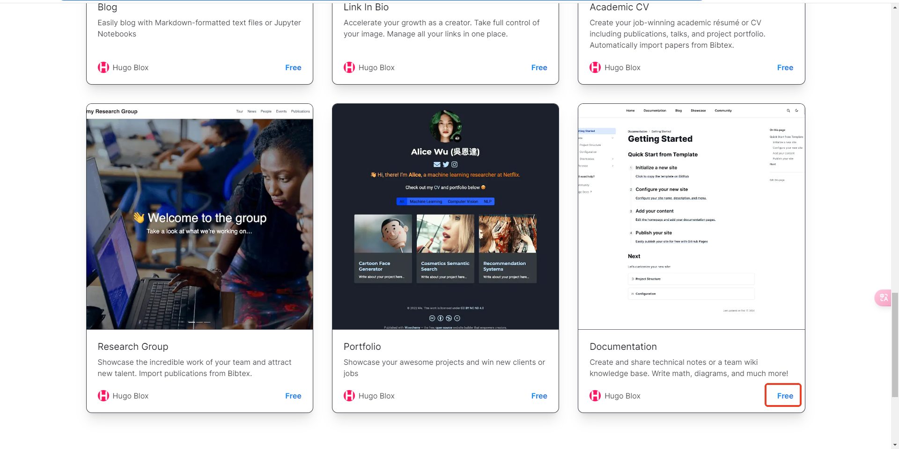
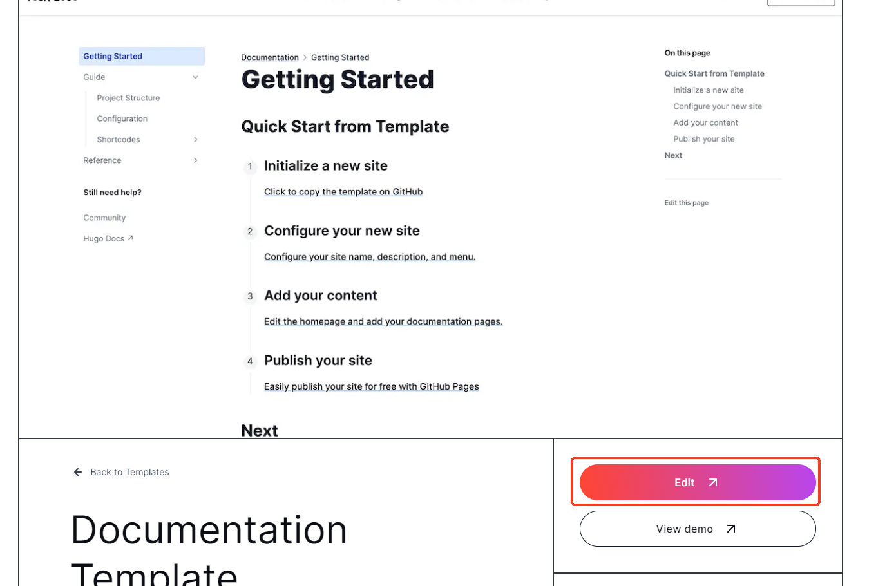
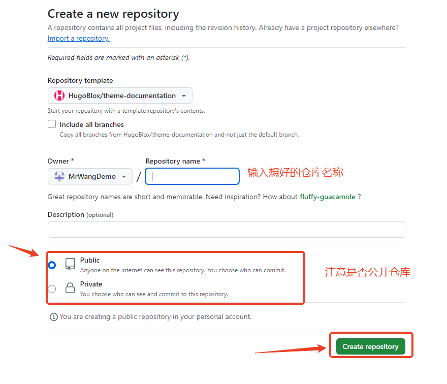
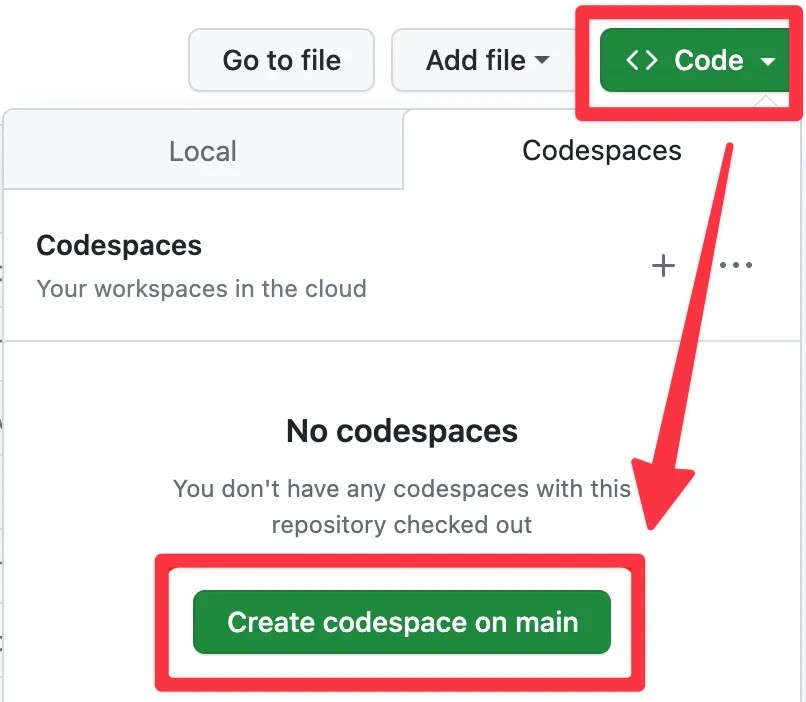
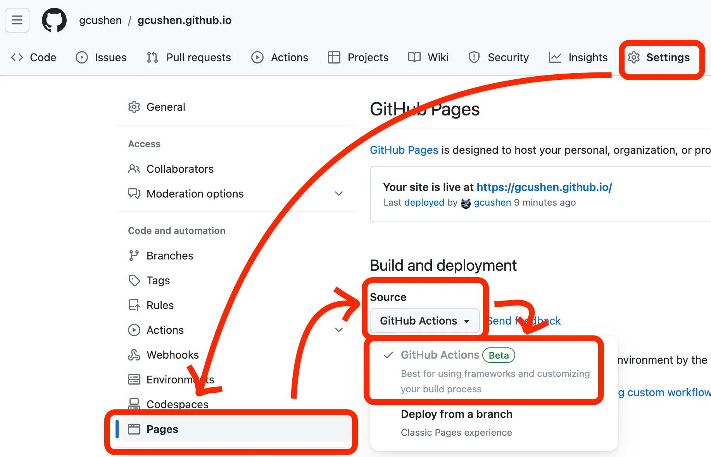
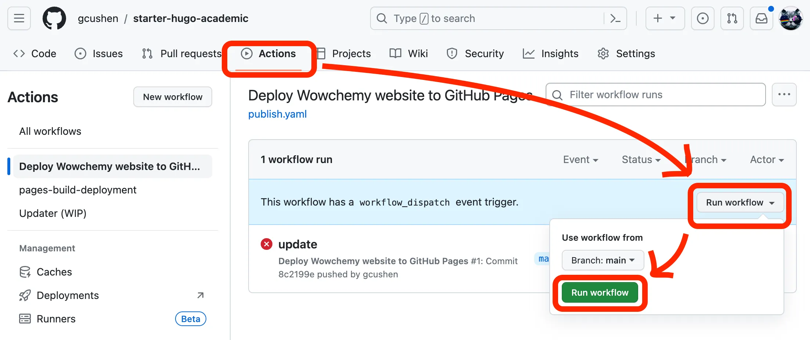
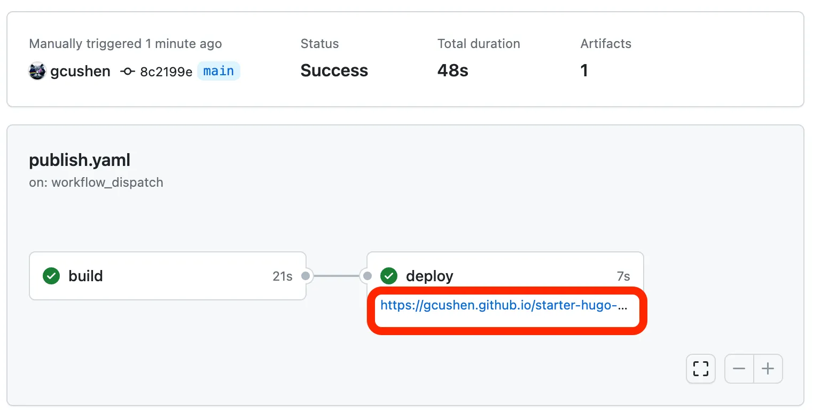

## 1.1 选择一个喜欢的模板

{}

###
访问hugo 的[模板地址](https://hugoblox.com/templates/)，选择一个免费的模板。自己还是比较喜欢简介一点的模板

###
点击edit ,会跳转到github 仓库。也可以点击view demo 查看演示效果

###
复制模板为自己的仓库

{}

## 1.2 编辑自己的博客内容
{}
###
跳转到仓库首页，点击“create codespace on main”

{}

## 1.3. 发布编辑的内容
{}

###

点击“Settings”->"Pages"->"GitHub ACtions", 打开pages功能

###

点击"Actions"->"Run workflow",开始运行构建工作

###

等一段时间后，页面面自动发布成功

{}

## 下一章

章节列表


  
  

